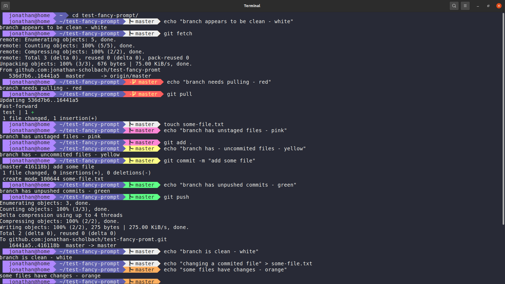

This is an adaptation of [fancy-git](https://github.com/diogocavilha/fancy-git),
tailored to my personal needs.

I removed all the configuration options which I found not necessary for me
personally, and refactored the code with a more functional approach. That made
it easier for me to move blocks around, and customize their colors.

# Features

## git

Inside a git repository, the git branch is displayed.

The background color of the branch is encoding the state of the repository:

-   branch needs pulling
-   branch has unstaged files
-   branch has uncommited files
-   branch has unpushed commits
-   branch is clean

## venv

If a virtual environment is activated, it is displayed.
